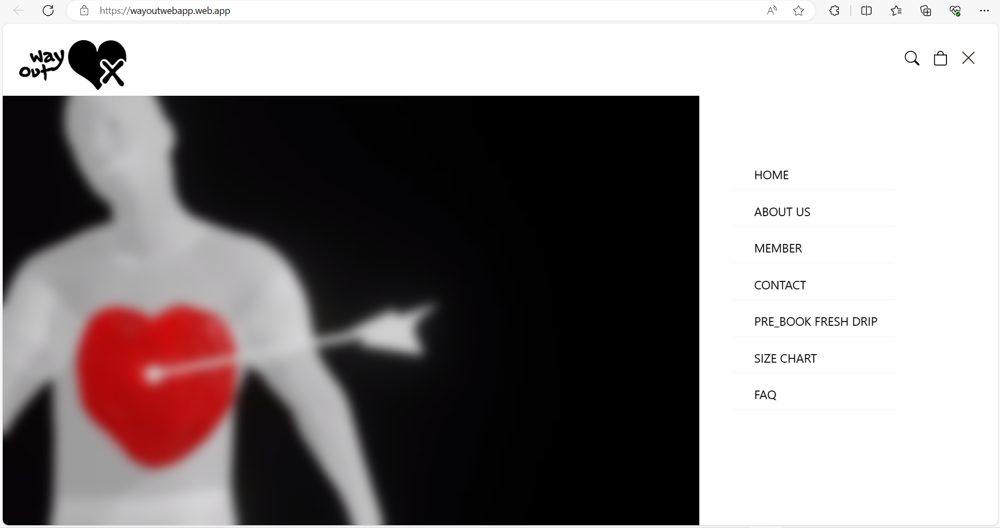
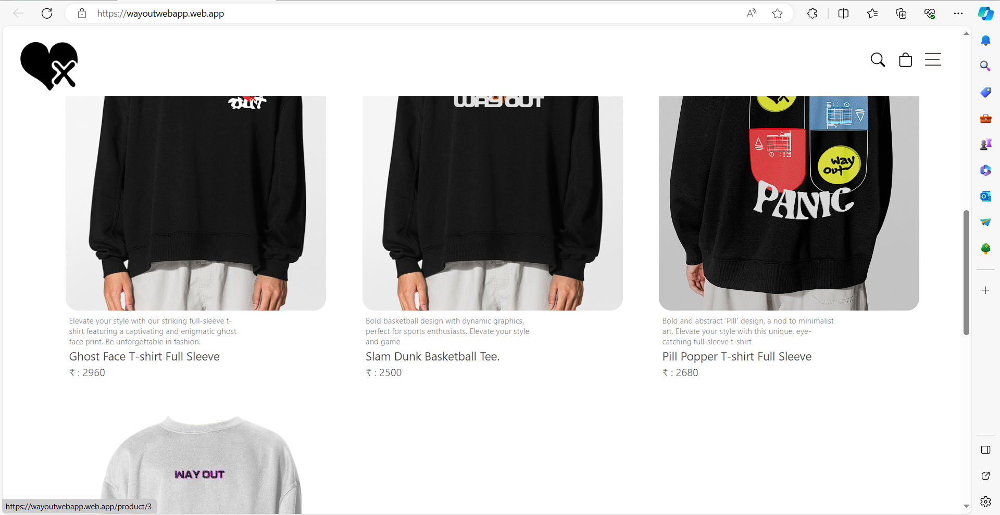
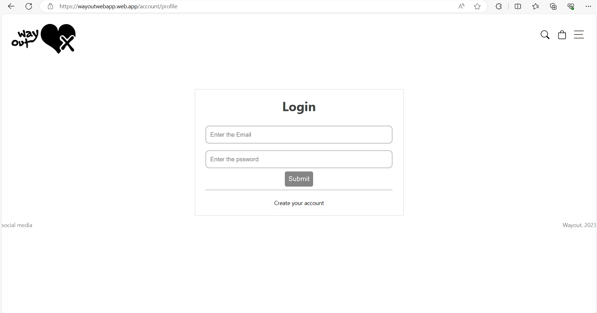
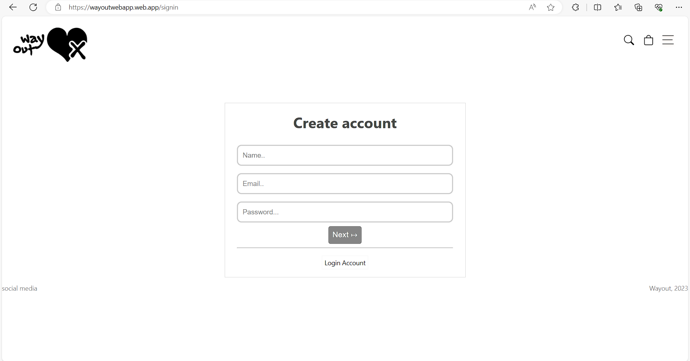
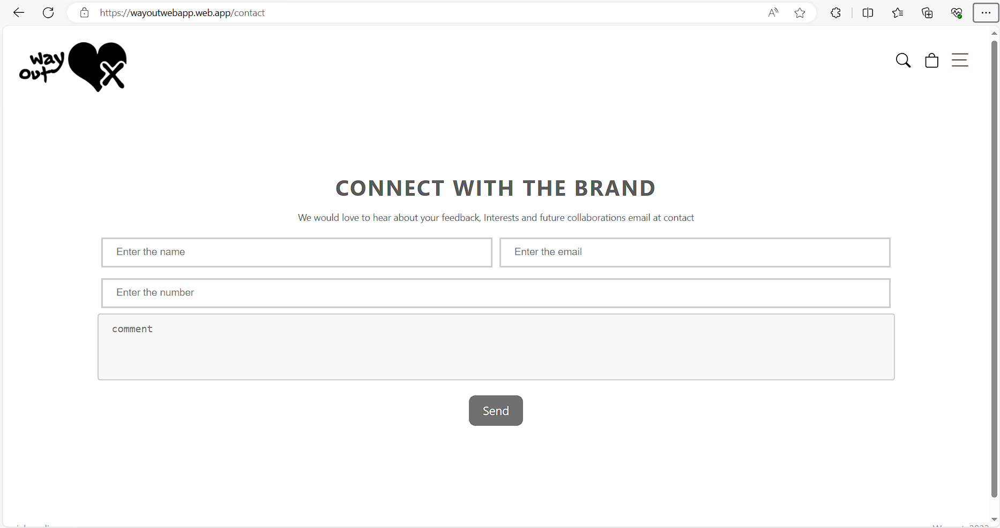
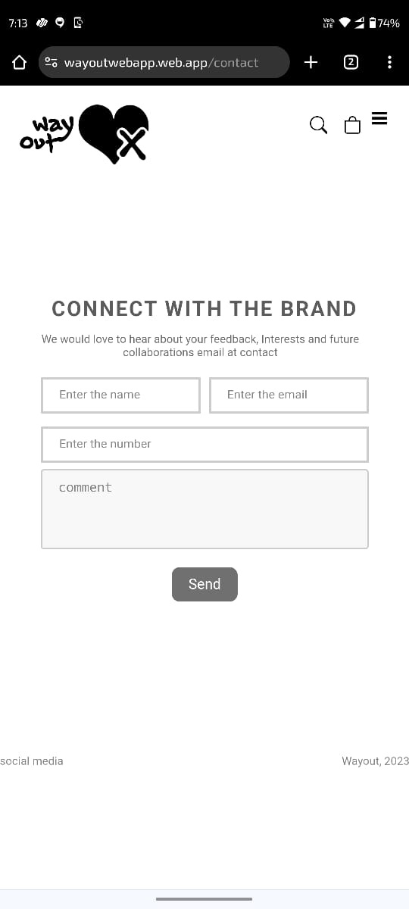
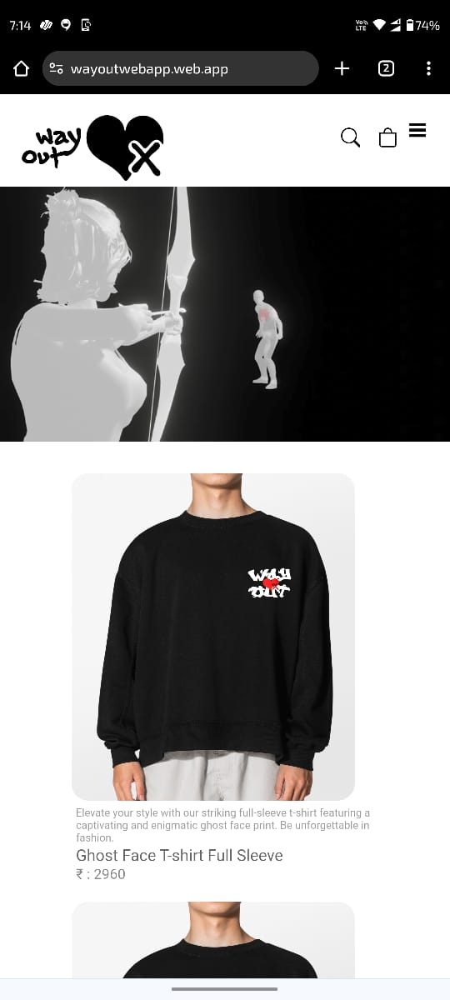
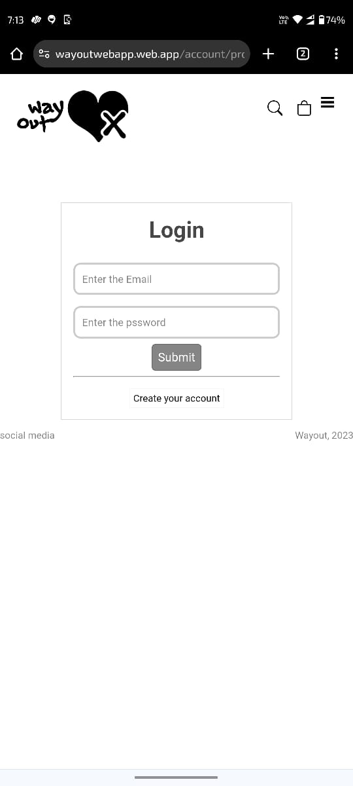
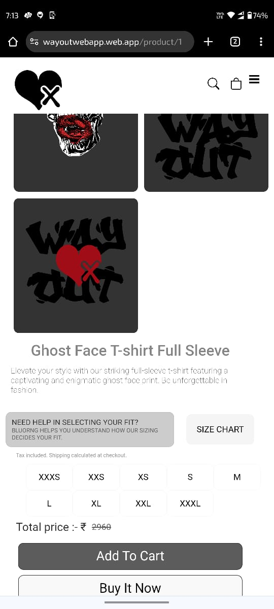

# Wayout - Ecommerce Website

### [Live Site](https://wayoutwebapp.web.app/)

# Desktop View







# Responsive View





## Introduction
Welcome to the Wayout-ecommerce code repository, designed to accompany our comprehensive project.

Throughout this project, I construct a fully functional Ecommerce WebApp specifically tailored for integration into the Wayout-ecommerce website. We'll harness the power of React for the frontend and employ NodeJS and php backend using MySQL Database.

## Features

- **Product Listing:** View a list of products with details such as name, price, and image.
- **Product Details:** Click on a product to view detailed information.
- **User Authentication:** Sign up and log in to manage orders and preferences.
- **Responsive Design:** Ensure a seamless experience across various devices.

Setup:
- ```git clone https://github.com/your-username/ecommerce-react.git```
-   ```cd ecommerce-react```
- ```npx create-react-app wayout-ecommerce```
- ```cd wayout-ecommerce```
- ```npm start```